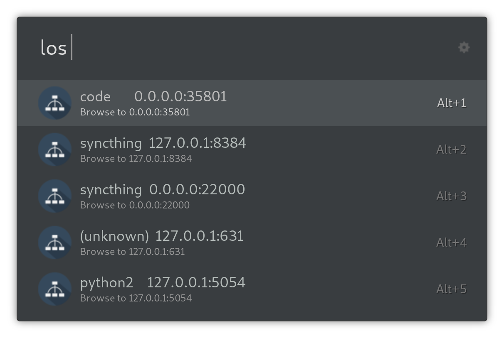

# ulauncher-local-listeners
This extension provides a quick way to browse to local http or https listeners instead of fishing the specific ports in your browser history.



## Requirements
This extension requires package `psutil` for python2.
To install:

```
  pip install psutil
```

or

```
  pip2 install psutil
```

for Arch users.
